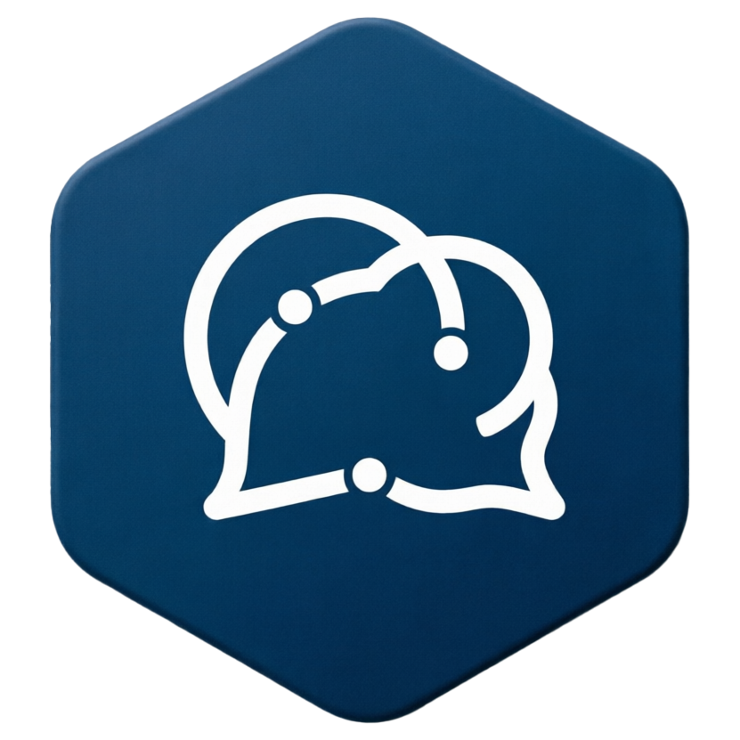
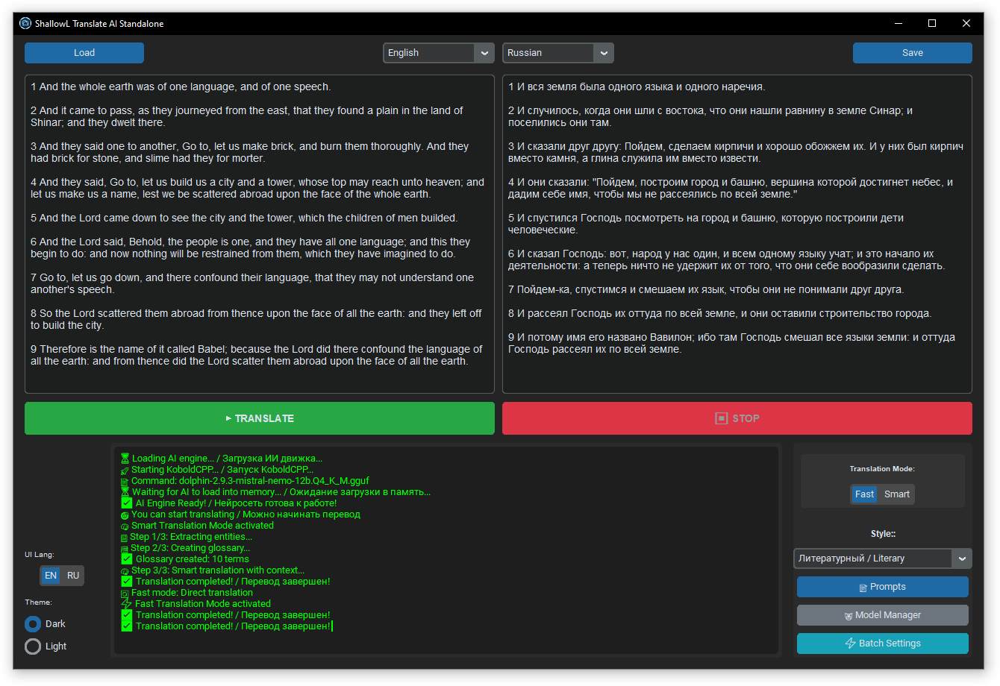

<div align="center">
  

  # ShallowL Translate AI Standalone

  **Мощный, локальный и полностью приватный ИИ-переводчик**
  
  [🇬🇧 English](README_EN.md) | 🇷🇺 **Русский**
</div>

## 🚀 О проекте
**ShallowL Translate AI Standalone** — это автономное приложение для высококачественного машинного перевода, работающее локально на вашем ПК. Проект использует современные языковые модели (LLM) и движок `KoboldCPP`, обеспечивая абсолютную конфиденциальность данных и качество перевода, сопоставимое с лучшими онлайн-сервисами.

Поддерживает видеокарты от 4 ГБ VRAM (рекомендуется 8+ ГБ для лучшего качества).



## ✨ Основные возможности
* **100% Локально:** Никаких облачных API, подписок или сбора данных. Ваш текст не покидает пределы компьютера.
* **Два режима перевода:**
  * **Быстрый режим:** Прямой перевод батчами для максимальной скорости.
  * **Умный режим:** Трёхэтапный процесс с извлечением сущностей, созданием глоссария и контекстным переводом для лучшего качества.
* **Менеджер моделей:** Встроенный загрузчик моделей с прогресс-баром. Выбирайте модель под свою видеокарту (4GB/6GB/8GB+).
* **Умные Промпты:** Встроенный редактор стилей перевода. Технические документы, художественная литература, игры (с сохранением тегов), гендерные стили.
* **Индивидуальные настройки ИИ:** Температура, Top-P и Штраф за повторы настраиваются для каждого промпта отдельно.
* **Настройки батчинга:** Гибкая настройка токенов и строк на батч с пресетами для разных моделей.
* **Мультиформатность:** Прямая загрузка `TXT`, `DOCX` и `PDF`. Сохранение готового перевода в `TXT` или `DOCX`.
* **Двуязычный UI:** Полная поддержка английского и русского языка интерфейса, темная и светлая темы.
* **Умные горячие клавиши:** `Ctrl+C/V/A` работают безупречно на любой раскладке клавиатуры.
* **Автоматическая очистка:** При закрытии программы VRAM видеокарты полностью освобождается.

## 🛠️ Установка и Запуск

### Требования
* ОС: Windows 10/11 (64-bit)
* GPU: NVIDIA или AMD (минимум 4 ГБ видеопамяти, рекомендуется 8+ ГБ)
> 💡 **Никакого стороннего софта:** Программа полностью автономна. Установка Python в систему **не требуется**, всё необходимое будет скачано и настроено внутри папки проекта автоматически.

### Шаг 1. Установка
1. Скачайте проект на свой компьютер (Code → Download ZIP).
2. Распакуйте архив в удобное место.
3. Запустите файл `01_install.bat`. Он автоматически:
   * Скачает и настроит портативную версию Python 3.12.
   * Установит все необходимые библиотеки (CustomTkinter, PyMuPDF, python-docx, OpenAI, requests).
   * Скачает движок `koboldcpp.exe` в папку `bin/`.
4. Дождитесь сообщения **"Setup completed successfully!"**

### Шаг 2. Запуск
В зависимости от вашей видеокарты, запустите соответствующий файл:
* Для видеокарт **NVIDIA**: `02_start_NVIDIA.bat`
* Для видеокарт **AMD**: `02_start_AMD.bat`

Программа запустится и начнет загрузку AI движка.

### Шаг 3. Загрузка модели
1. При первом запуске появится сообщение **"Model not found!"**
2. Нажмите кнопку **"🤖 Model Manager"** (Менеджер моделей)
3. Выберите модель под вашу видеокарту:
   * **8GB+ VRAM:** Dolphin Mistral Nemo 12B, Llama 3.1 8B
   * **6GB+ VRAM:** Qwen 2.5 7B, Mistral 7B
   * **4GB+ VRAM:** Llama 3.2 3B, Gemma 2 2B
4. Нажмите **"Download"** и дождитесь завершения загрузки
5. Нажмите **"Use"** для активации модели
6. Программа автоматически перезапустится с выбранной моделью

### Шаг 4. Начало работы
После загрузки модели появится сообщение **"✅ AI Engine Ready!"** — можно начинать перевод!

## 📖 Использование

### Базовый перевод
1. Нажмите **"Load"** и выберите файл (TXT/DOCX/PDF) или вставьте текст в левое окно
2. Выберите исходный и целевой языки
3. Выберите стиль перевода (Строгий, Литературный, Технический и др.)
4. Выберите режим: **Fast** (быстро) или **Smart** (качественно)
5. Нажмите **"TRANSLATE"**
6. Результат появится в правом окне
7. Нажмите **"Save"** для сохранения перевода

### Настройка промптов
1. Нажмите **"📝 Prompts"** для открытия редактора
2. Выберите существующий промпт или создайте новый (**"New"**)
3. Настройте параметры AI:
   * **Temperature:** 0.1-0.3 для точности, 0.7-1.2 для креативности
   * **Top-P:** 0.5 для строгости, 0.9-1.0 для разнообразия
   * **Penalty:** 1.1-1.2 для избежания повторов
4. Нажмите **"Save"**

### Настройка батчинга
1. Нажмите **"⚡ Batch Settings"**
2. Настройте параметры или выберите пресет:
   * **Quality:** Медленно, высокое качество
   * **Balanced:** Оптимальный баланс (рекомендуется)
   * **Speed:** Быстро, может снизить качество
   * **Auto:** Автоматические настройки для текущей модели
3. Нажмите **"Apply"**

## 🔧 Структура проекта
```
AITranslator/
├── lang/                    # Файлы локализации
│   └── translations.json
├── bin/                     # Исполняемые файлы (создается при установке)
│   ├── python/             # Портативный Python
│   └── koboldcpp.exe       # AI движок
├── models/                  # AI модели (создается при загрузке)
├── main.py                  # Основной код приложения
├── icon.ico                 # Иконка приложения
├── SLTAISlogo.png          # Логотип
├── gui.png                  # Скриншот интерфейса
├── 01_install.bat          # Скрипт установки
├── 02_start_NVIDIA.bat     # Запуск для NVIDIA
├── 02_start_AMD.bat        # Запуск для AMD
└── README.md               # Документация
```

## ❓ FAQ

**Q: Программа не запускается / вылетает**  
A: Убедитесь, что у вас установлены последние драйверы видеокарты. Проверьте `app.log` для деталей ошибки.

**Q: Модель загружается слишком долго**  
A: Это нормально для больших моделей (7-12GB). Первая загрузка может занять 1-3 минуты в зависимости от скорости диска.

**Q: Перевод получается странным**  
A: Попробуйте:
- Переключиться на Smart режим
- Выбрать другой стиль промпта
- Настроить параметры AI (снизить Temperature для точности)
- Использовать более качественную модель

**Q: Можно ли использовать свои модели?**  
A: Да, поместите GGUF файл в папку `models/` и выберите его через Model Manager.

**Q: Программа занимает много VRAM**  
A: Выберите модель меньшего размера (Q2_K/Q3_K квантизация) или модель с меньшим количеством параметров (3B вместо 7B).

## 📝 Лицензия
Проект распространяется "как есть" под MIT License. Вы можете свободно модифицировать код под свои нужды.

## 🤝 Благодарности
* [KoboldCPP](https://github.com/LostRuins/koboldcpp) - AI движок
* [CustomTkinter](https://github.com/TomSchimansky/CustomTkinter) - UI фреймворк
* Сообщество HuggingFace за предоставление моделей

---

<div align="center">
  Made with ❤️ for privacy-conscious translators
</div>